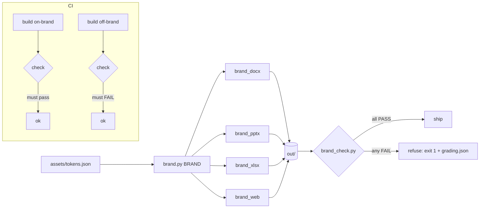

# brand-gate

[](https://github.com/jbisaccia-9/brand-gate/actions/workflows/ci.yml)

**A Claude Code skill that brands every deliverable by default — and the gate that refuses any file that is off-brand.**

Most "brand guideline" skills are a palette pasted into a prompt. This one is
the production shape: a trigger description that fires *without being asked*,
a toolkit locator, builders for Word / PowerPoint / Excel / HTML that make plain
library calls come out branded, and a checker that grades the outputs by rule
number and exits non-zero. On the current samples: **4/4 on-brand files pass,
4/4 counterexamples are refused — each for exactly the rule in its filename.**

## Quickstart

```bash
pip install git+https://github.com/jbisaccia-9/brand-gate
python -m brandgate build out/onbrand  && python -m brandgate check out/onbrand    # PASSED
python -m brandgate offbrand out/off   && python -m brandgate check out/off        # FAILED, exit 1
```

To use the skill itself, copy `skill/brand-style/` into `~/.claude/skills/`
(or your project's `.claude/skills/`). Claude will brand every `.docx` / `.pptx`
/ `.xlsx` / `.html` it produces, and you run `scripts/brand_check.py` on the
output directory before anything goes out.

## Why this shape

The brand is the one thing nobody asks for and everybody notices when it's
missing. The skill makes branding the *default*, not a request — and a default
that can't be verified is a hope. So the checklist at the bottom of the skill
(`Before delivering`) is the same list the checker enforces, by number:

| rule | what it catches | how it's checked |
|---|---|---|
| R1 | pure-black `#000000` type | run/style colors in docx/pptx/xlsx; screen CSS in html |
| R2 | a font outside the approved set | explicitly-set font families |
| R3 | no logo on the opening surface; logo under 1 in | inline shapes / slide-1 pictures / header `` |
| R4 | color logo on a saturated fill | picture on a slide whose background is a primary color |
| R5 | chart series off the brand order | native chart series fills vs `CHART_SERIES` |
| R6 | a background tint used for type | text colors ∩ tint palette |

## How it works



The CI job asserts both directions: the on-brand samples must pass, and the
off-brand counterexamples must be refused (`! python -m brandgate check ...`).
A gate that only ever passes hasn't been tested.

## The gate earned its keep on the first run

The first on-brand `.docx` **failed** R1 and R2. python-docx's default template
ships built-in styles nobody uses — `Macro Text` in Courier, a black-colored
one — and the checker was grading the style catalog instead of the text. A
style no reader can see can't be off-brand, so the checker now resolves each
paragraph's style chain and grades only what text actually renders in. That
fix has its own test. See [RESULTS.md](RESULTS.md) for the captured run.

## What's in the skill

```
skill/brand-style/
  SKILL.md              trigger description + rules + per-format recipes + checklist
  assets/tokens.json    the single source: fonts, palette, series order, logo files
  assets/logo-*.png     placeholder marks (generated, not artwork)
  scripts/brand.py      BRAND.BLUE, BRAND.rgb("BLUE"), BRAND.logo("primary")
  scripts/brand_docx.py brand_pptx.py brand_xlsx.py brand_web.py
  scripts/brand_check.py  the gate
```

Three skill-design choices worth copying:

- **The description is the trigger.** It lists the file types, the document
  genres, and says explicitly to fire "even when the user says nothing about
  branding." A skill that waits to be invoked by name is a skill that never runs.
- **Locate, don't assume.** The locator globs a fixed depth across the skill
  cache and working folders and tests for a *marker file*, not a directory
  name — installed skills move, and a copy of SKILL.md with no assets beside it
  must not be mistaken for the toolkit. If nothing is found, the skill says so
  rather than shipping default fonts and no logo.
- **`finish()` reopens the file.** A malformed OOXML part fails silently at
  write time and loudly on the recipient's machine. Every builder saves and
  reopens, so it fails on yours.

## Scope, stated honestly

- **Northlight is fictional.** Every color, font, and logo here is a stand-in;
  the shape is real, the identity is not. Replace `tokens.json`, the logos,
  and the voice section with your guide's values.
- Fonts are *named*, not bundled. Inter is OFL and safe to embed; the SKILL.md
  explains the preview-and-print licensing trap for corporate fonts, which is
  the real-world reason Office files open read-only.
- The checker reads explicitly-set properties. Text that inherits an unapproved
  font through a theme it never names will pass — matching the conservative
  "grade what's set" rule that stopped the false positive above.
- PDF is checked by checking the HTML/Office file it was printed from.

## Part of the *-gate* family

Nothing ships until it passes a gate — and the gate itself must be earned.
The others: [github.com/jbisaccia-9](https://github.com/jbisaccia-9).

MIT.
